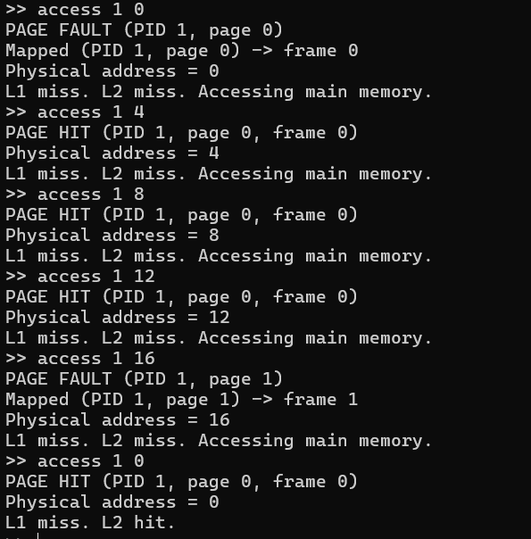
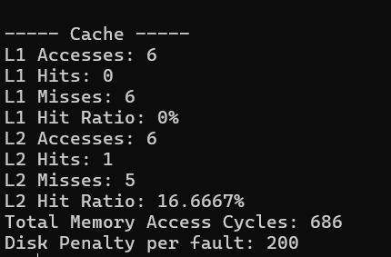
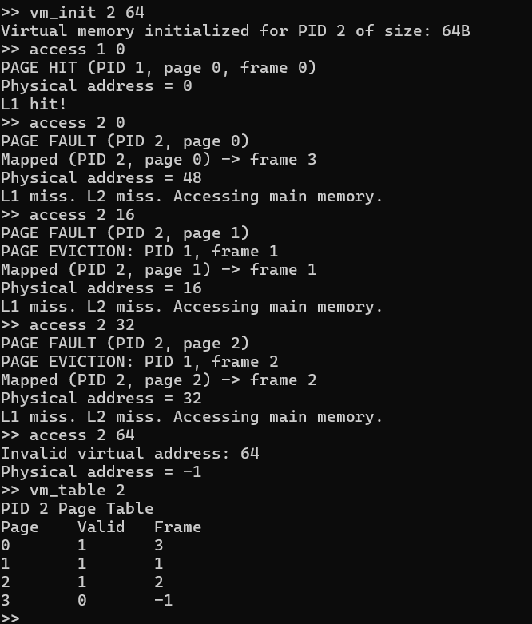
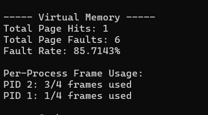

# Memory Management Simulator — Design Document

## 1. Memory Layout & Assumptions
Physical memory is modeled as a contiguous array divided into fixed‑size frames(congigurable by user).  
Virtual memory provides each  process with its own address space, and
page tables map virtual pages to physical frames,page size is same as frame size .

**Assumptions**

- fixed page/frame size   
- demand‑paging: pages are created on first access (page fault)  


Virtual Addr → Page Table → Physical Addr → Cache → Main Memory

---

## 2. Allocation Strategies (First_fit, Best_Fit, Worst_Fit)

A free‑list tracks blocks inside a simulated heap.Free contiguous memmory are grouped together as required.If no block present of >= required size allocation is failed

| Strategy   | Description                         | 
|------------|-------------------------------------|
| First Fit  | first block large enough            |
| Best Fit   | smallest block that fits           |
| Worst Fit  | largest available block            |

Fragmentation and utilization statistics are present in comparision table.
<table>
<tr>
  <td>
    <br>
    
  </td>

  <td>
    <br>
    
  </td>
</tr>
</table>


## 3. Buddy System Design
Memory is divided into **power‑of‑two** sized blocks.Free contiguous memmory are grouped together as required.If no block present of >= required size allocation is failed


**Algorithm**

1. round request to nearest power‑of‑two.(using ceil)
2. split larger blocks recursively  
3. on free, merge buddies whenever both are free  

 fast split/merge, zero external fragmentation  
 possible internal fragmentation

<p align="center">
  
</p>


---

## 4. Cache Hierarchy & Replacement
Two‑level cache model:

- **L1** — Small and  fast (1 cycle latency),checked first.
- **L2** — Larger but slower (5 + 1 cycle latency) , checked if L1 misses 
- **Set Associativity:** Caches are divided into "Sets." A memory block can only go into a specific set based on its address.Set index is obtained by formula : *Set Index = (Memory Address / Block Size) % Number of Sets*.
Lookup order:

L1 → L2 → Main Memory

Replacement policy: **FIFO** - The block that entered the cache *earliest* is removed first. This is implemented using a queue structure for each set.  

We track:

- cache hits / misses  
- main‑memory accesses  
- symbolic cycle cost (illustrative, not hardware‑accurate)

Spatial locality appears naturally because entire blocks are fetched per access.
<table>
<tr>
  <td>
    <br>
    
  </td>

  <td>
    <br>
   
  </td>
</tr>
</table>
---

## 5. Virtual Memory Model
Paging maps virtual pages to physical frames.

**Access flow**

1. compute page number + offset  
2. page‑table lookup  
3. if missing → page fault  
4. allocate a frame and install mapping  

Page replacement uses **LRU**.  
* **Implementation:** Every time a page is accessed, a global `last_used` timestamp is updated in the Page Table Entry.
* **Eviction:** When a frame is needed, the system inspects all pages currently in RAM and evicts the one with the **oldest** timestamp.

We track page hits, faults, and per‑process frame usage.
<table>
<tr>
  <td>
    <br>
    
  </td>

  <td>
    <br>
    
  </td>
</tr>
</table>
---

## 6. Address Translation Flow

       ┌───────────────┐
       │ Virtual Addr  │
       └───────┬───────┘
               ↓
       ┌───────────────┐
       │ Page | Offset │
       └───────┬───────┘
               ↓
       ┌───────────────┐
       │ Page Table    │
       └───────┬───────┘
        page present?
        ┌──────┴──────┐
       YES           NO
        |            |
        |      ┌───────────────┐
        |      │ Page Fault   │
        |      │ (allocate or │
        |      │  replace)    │
        |      └───────┬──────┘
        |              ↓
        └────────► Physical Frame
                      ↓
              ┌───────────────┐
              │ Cache Lookup  │
              └───────┬───────┘
                      │
                    hit?
            ┌─────────┴─────────┐
           YES                 NO
            │                   │
    ┌───────────────┐   ┌───────────────┐
    │   Return      │   │   Main Mem    │
    │    (L1/L2)    │   │  (load data)  │
    └───────┬───────┘   └───────┬───────┘
            └──────────────► Data Returned


## 7. Compare Mode (Allocation Strategy Comparison)

The simulator can replay the same workload under multiple strategies  
(**FF, BF, WF, Buddy**) and report statistics 

- allocation successes / failures  
- memory utilization  
- internal / external fragmentation  
- total allocations and frees  

This mode does not change allocator behavior — it only **evaluates** it.
<p align="center">
  
</p>


---
## 8. Project Structure
```text
MemorySimulator/
├── docs/                    
│  └── DesignDoc.md        # Detailed Design Document
│  └── images/             # images of test outputs used in this docs
├── include/               # Header files (.h)
│   ├── buddy.h
│   ├── cache.h
│   ├── memory.h
│   └── vm.h
├── output/                  # Generated logs ,created when tests run
│   ├── buddy_log.txt
│   ├── cache_log.txt
│   ├── compare_log.txt
│   ├── linear_log.txt
│   └── vm_log.txt
├── src/                     # Implementation files (.cpp) including main.cpp for CLI
│   ├── buddy.cpp
│   ├── cache.cpp
│   ├── main.cpp
│   ├── memory.cpp
│   └── vm.cpp
├── test/                    # Input workloads
│   ├── buddy_test.txt
│   ├── cache_access_test.txt
│   ├── compare_allocation_test.txt
│   ├── linear_allocation_test.txt
│   └── vm_access.txt
├── .gitignore
├── Makefile                 # Build configuration script
├── README.md                # Project documentation
│── all_tests_output.txt     # output of all test cases
├── run_all_tests.bat        # Windows automated test runner
└── run_all_tests.sh         # Linux/Mac automated test runner
```

---

## 9. Limitations & Simplifications

* Implicit demand paging: unmapped pages trigger a page fault and are automatically mapped (no segmentation faults).
* Heap & paging are independent: allocators manage heap; paging manages frames/page tables separately.
* No protection bits: R/W/X permissions are not simulated.
* Abstracted CPU behavior: we model translation flow, not full instruction execution or traps.
* Simplified replacement: LRU for pages, FIFO for cache (no dirty‑bit/disk writes).

---

## 10. Testing & Validation

  I did the following tests

- allocation & fragmentation  
- buddy split/merge behavior  
- page faults vs. hits  
- cache hit/miss patterns  
- strategy comparison  

Outputs go to `output/`, while combined results goes in all_tests_output.txt.


Screenshots and the demo video and output files  explained the correctness of test cases.

---

## 11. Conclusion
I implemented the memory management simulator including buddy systems ,linear allocation,cache ,virtual memory . I added the test cases and their results i verified all of them were correct showing correct implementation .


