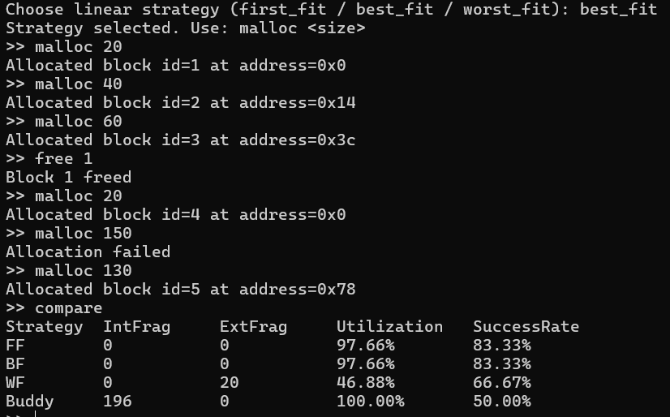

# Memory Management Simulator — Design Document

## 1. Memory Layout & Assumptions
Physical memory is modeled as a contiguous array divided into fixed‑size frames.  
Virtual memory provides each  process with its own address space, and
page tables map virtual pages to physical frames.

**Assumptions**

- fixed page/frame size   
- demand‑paging: pages are created on first access (page fault)  
- statistics are simulated (not hardware‑measured)

Virtual Addr → Page Table → Physical Addr → Cache → Main Memor

---

## 2. Allocation Strategies (First_fit, Best_Fit, Worst_Fit)

A free‑list tracks blocks inside a simulated heap.Free contiguous memmory are grouped together as required.

| Strategy   | Description                         | 
|------------|-------------------------------------|
| First Fit  | first block large enough            |
| Best Fit   | smallest block that fits           |
| Worst Fit  | largest available block            |

Fragmentation and utilization statistics are present in comparision table.
<table>
<tr>
  <td>
     
    
  </td>

  <td>
     
    
  </td>
</tr>
</table>

## 3. Buddy System Design
Memory is divided into **power‑of‑two** sized blocks.Free contiguous memmory are grouped together as required.

**Algorithm**

1. round request to nearest power‑of‑two  
2. split larger blocks recursively  
3. on free, merge buddies whenever both are free  

 fast split/merge, zero external fragmentation  
 possible internal fragmentation

  

---

## 4. Cache Hierarchy & Replacement
Two‑level cache model:

- **L1** — small & fast  
- **L2** — larger & slower  

Lookup order:

L1 → L2 → Main Memory

Replacement policy: **FIFO**.  

We track:

- cache hits / misses  
- main‑memory accesses  
- symbolic cycle cost (illustrative, not hardware‑accurate)

Spatial locality appears naturally because entire blocks are fetched per access.

---

## 5. Virtual Memory Model
Paging maps virtual pages to physical frames.

**Access flow**

1. compute page number + offset  
2. page‑table lookup  
3. if missing → page fault  
4. allocate a frame and install mapping  

Page replacement uses **LRU**.  
We track page hits, faults, and per‑process frame usage.

---

## 6. Address Translation Flow

       ┌───────────────┐
       │ Virtual Addr  │
       └───────┬───────┘
               ↓
       ┌───────────────┐
       │ Page | Offset │
       └───────┬───────┘
               ↓
       ┌───────────────┐
       │ Page Table    │
       └───────┬───────┘
        page present?
        ┌──────┴──────┐
       YES           NO
        |            |
        |      ┌───────────────┐
        |      │ Page Fault   │
        |      │ (allocate or │
        |      │  replace)    │
        |      └───────┬──────┘
        |              ↓
        └────────► Physical Frame ◄────────┘
                      ↓
              ┌───────────────┐
              │ Cache Lookup  │
              └───────┬───────┘
                      │
                    hit?
            ┌─────────┴─────────┐
           YES                 NO
            │                   │
    ┌───────────────┐   ┌───────────────┐
    │   Return      │   │   Main Mem    │
    │    (L1/L2)    │   │  (load data)  │
    └───────┬───────┘   └───────┬───────┘
            └──────────────► Data Returned

## 7. Compare Mode (Allocation Strategy Comparison)

The simulator can replay the same workload under multiple strategies  
(**FF, BF, WF, Buddy**) and report statistics side‑by‑side:

- allocation successes / failures  
- memory utilization  
- internal / external fragmentation  
- total allocations and frees  

This mode does not change allocator behavior — it only **evaluates** it.

  

---

## 8. Limitations & Simplifications (why we chose them)

- **Implicit demand paging** — focus on paging instead of crash behavior  
- **Heap & paging independent** — simpler, easier to reason about  
- **LRU (pages) / FIFO (cache)** — clear and explainable policies  
- **Symbolic timing** — shows trends without hardware modeling  
- **No TLB, interrupts, permissions, or real disk I/O** — reduced complexity  
---

## 9. Testing & Validation

  I did the following tests

- allocation & fragmentation  
- buddy split/merge behavior  
- page faults vs. hits  
- cache hit/miss patterns  
- strategy comparison  

Outputs go to `output/`, while combined results goes in all_tests_output.txt.

Screenshots and the demo video and output files  explained the correctness of test cases.

---

## 10. Conclusion
I implemented the memory management simulator including buddy systems ,linear allocation,cache ,virtual memory . I added the test cases and their results i verified all of them were correct showing correct implementation .

